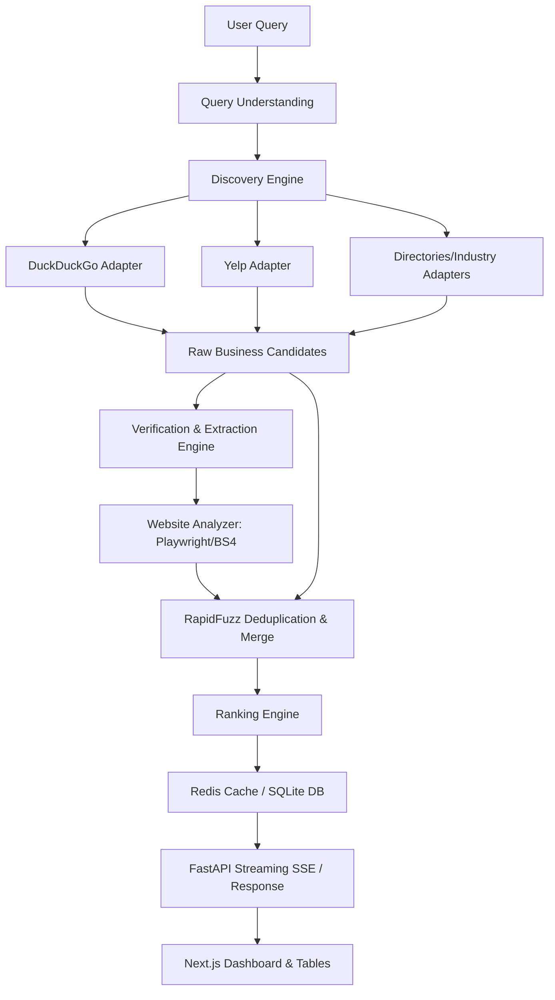
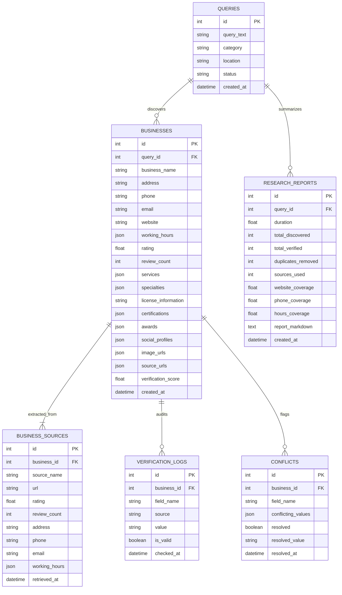

# AI-Powered Business Research Agent

An autonomous, multi-source business discovery and verification agent designed to act as a professional research analyst. It crawls public search results, parses official websites, cross-checks fields, resolves conflicts, deduplicates matches, and ranks them by data completeness and verification trust.

---

## Features

1. **Query Parsing**: Recognizes category and location splits (e.g. *"Cardiologists in Birmingham"*).
2. **Multi-Source Discovery**: Conditionally executes adapters (DuckDuckGo, Yelp, Yellow Pages, Healthgrades, Avvo, Angi).
3. **Deep Web Crawl**: Crawls official sites via `BeautifulSoup` with client-side JavaScript rendering fallback using `Playwright`.
4. **Field Verification**: Audits and cross-checks phone numbers, emails, addresses, and hours across directories.
5. **Conflict Tracking**: Detects discrepancies (e.g., mismatched contact details) and allows manual resolution in the UI.
6. **Deduplication**: Uses `RapidFuzz` to cluster and merge duplicate candidates.
7. **Ranking**: Orders entities based on verification score, rating/reviews volume, and completeness.
8. **Real-time SSE Streaming**: Delivers progress, logs, and verified business updates incrementally.
9. **Import/Export**: Integrates CSV/JSON exports and bulk CSV imports.

---

## System Architecture



---

## Entity-Relationship (ER) Diagram



---

## Setup & Run Instructions

### Prerequisites
- Python 3.12+
- Node.js 20+
- Redis (Optional, automatic in-memory fallback enabled)

### Local Dev Setup

#### 1. Backend Service
```bash
cd backend
python -m venv .venv
# Activate:
# Windows: .venv\Scripts\activate | Unix: source .venv/bin/activate
pip install -r requirements.txt
playwright install chromium

# Copy configuration
copy .env.example .env

# Seed initial data (Creates 500 verified businesses)
python seed_data.py

# Launch FastAPI
python app/main.py
```
*API will run on `http://localhost:8000`. OpenAPI docs at `http://localhost:8000/docs`.*

#### 2. Frontend Next.js Service
```bash
cd frontend
npm install
npm run dev
```
*Frontend will run on `http://localhost:3000`.*

---

## Running with Docker Compose

To start the entire stack including Redis caching and Postgres storage:
```bash
docker-compose up --build
```
- Frontend: `http://localhost:3000`
- Backend: `http://localhost:8000`
- Postgres: `localhost:5432`
- Redis: `localhost:6379`

---

## API Documentation Examples

### 1. Trigger Research Run
- **Endpoint**: `POST /api/research`
- **Request**:
  ```json
  {
    "query": "Cardiologists in Birmingham"
  }
  ```
- **Response**:
  ```json
  {
    "query_text": "Cardiologists in Birmingham",
    "category": "cardiologists",
    "location": "Birmingham",
    "id": 1,
    "status": "pending",
    "created_at": "2026-06-22T20:45:00.123456",
    "updated_at": "2026-06-22T20:45:00.123456"
  }
  ```

### 2. Stream Research Progress (SSE)
- **Endpoint**: `GET /api/research/{query_id}/stream`
- **Output Event Stream**:
  ```
  data: {"status": "parsing", "message": "Parsed query: Category='cardiologists', Location='Birmingham'", "query_id": 1}
  data: {"status": "discovering", "message": "Searching directories...", "query_id": 1}
  data: {"status": "business_discovered", "message": "Verified & indexed: ABC Heart Clinic", "data": {...}}
  data: {"status": "completed", "message": "Research run completed successfully!", "data": {...}}
  ```

### 3. Fetch Operational Stats
- **Endpoint**: `GET /api/stats`
- **Response**:
  ```json
  {
    "total_queries": 5,
    "total_businesses": 500,
    "total_reports": 5,
    "duplicates_removed_total": 85,
    "avg_duration": 14.2,
    "recent_activity": [
      {
        "query_id": 1,
        "query_text": "Cardiologists in Birmingham",
        "status": "completed",
        "created_at": "2026-06-22T20:45:00.123456"
      }
    ]
  }
  ```

### 4. Resolve Conflict Manually
- **Endpoint**: `POST /api/conflicts/{conflict_id}/resolve`
- **Request**:
  ```json
  {
    "resolved_value": "(205) 111-1111"
  }
  ```
- **Response**:
  ```json
  {
    "id": 12,
    "business_id": 43,
    "field_name": "phone",
    "conflicting_values": ["(205) 111-1111", "(205) 222-2222"],
    "resolved": true,
    "resolved_value": "(205) 111-1111",
    "resolved_at": "2026-06-22T20:49:00.654321"
  }
  ```
